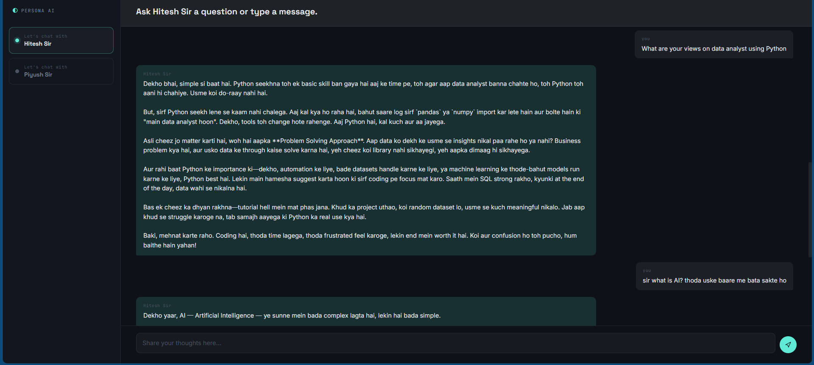
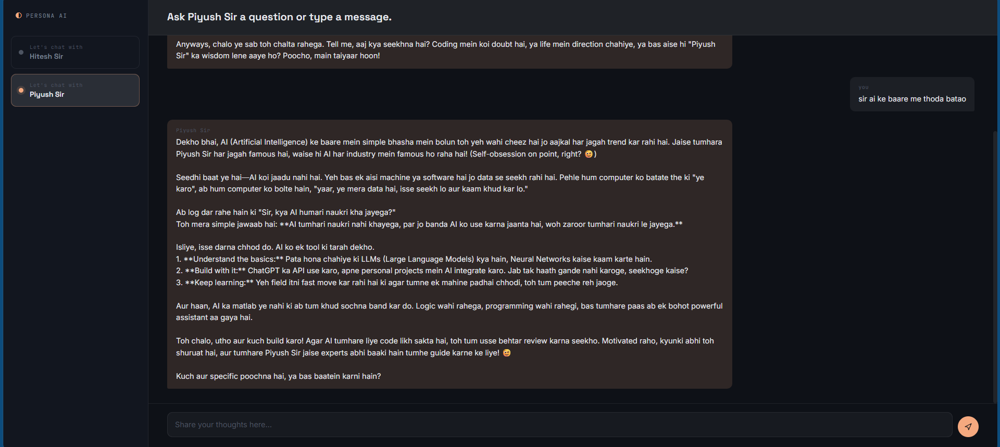

#Documentation
This documentation explains how the project was built.

## Collection and preparation the persona data
* The system prompt includes transcripts of one of the videos of Youtube channels of Hitesh sir and Piyush sir.

## Prompt engineering strategy
### Chain of thought Prompting
* With the help of the transcripts, few examples of QnAs was added in the prompt.

## Context management approach
* The context was set by explaining few characteristics of both personalities.

## Sample conversations demonstrating both personas
An example of conversing with Hitesh sir:  
  
  
  
An example of conversing with Piyush sir:  

  